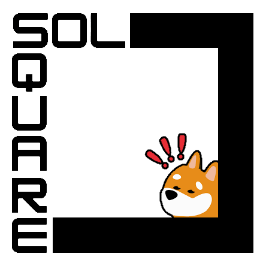
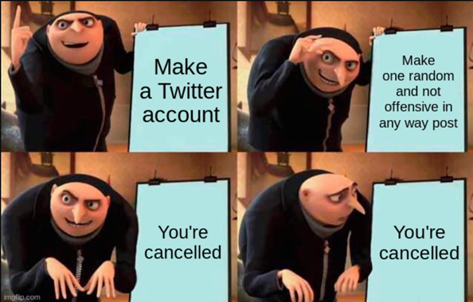
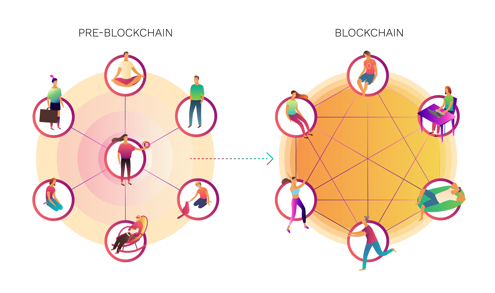
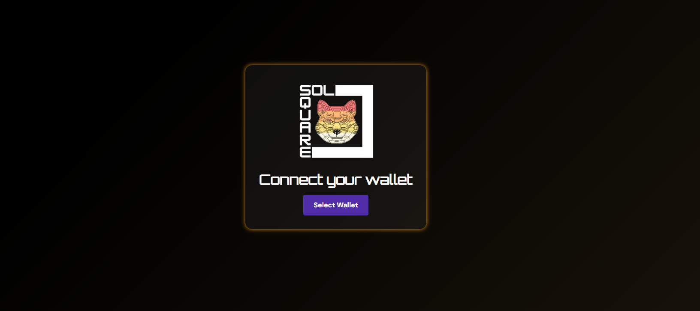
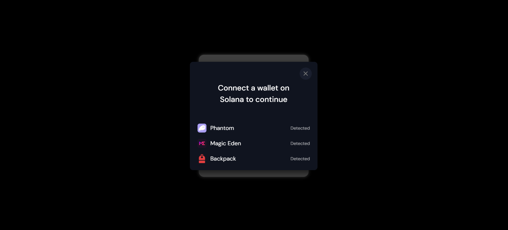
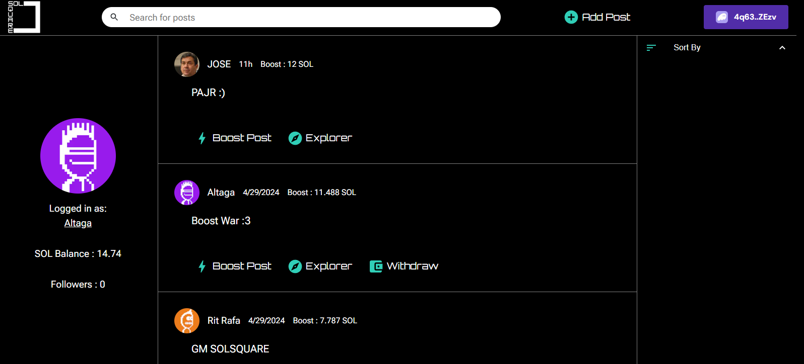
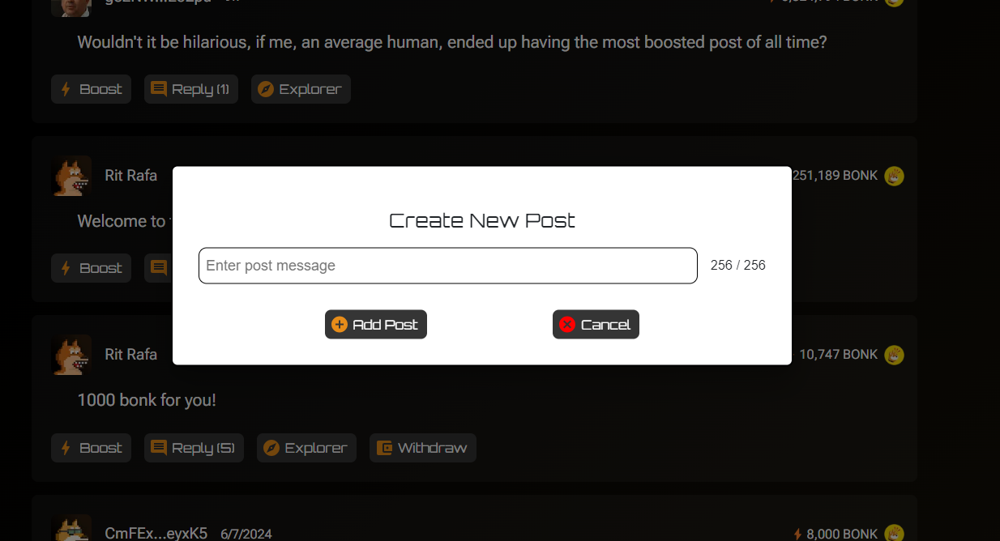

# SOLSQUARE

### You own what you create.

SolSquare is a decentralized censorship-free post/tweet platform that promotes economic incentives for good behavior powered by Bonk Token and AI Rudeness Detection.

# Fast Links:

- WebDapp: https://www.solsquare.net/
- BackEnd Code: [Code](./Backend/)
- FrontEnd Code: [Code](./Vercel/)
- Pitch Deck: [Deck](./Presentation/)
- Video Demo: [Video](https://youtu.be/LP2YR1wCiQg)

# Inspiration

Centralized social media platforms have shown the tendency to censor user data, and influence perception. 

Heated debates have happened on censorship and algorithmic control. [1](#references).

This is what users feel like on centralized content platforms.

Social platforms make a profit by charging you for access or selling your attention. What if it was inexpensive? 

SolSquare was conceptualized to promote cost-effective censorship-free expression, yet use economic incentives for good behavior through boosting, for consent or dissent. 

# Solution:

SolSquare is like a digital decentralized space for open expression without anyone controlling what's said. It encourages good behavior by rewarding positive contributions by boosts, all the boost and rewards are based on Bonk Token. Fully built on Solana, it's fast and secure, ensuring everyone can freely express themselves.

# System Diagram:

- Solana Native Rust: We built the entire backend in Solana Native Rust because it was easy to add complex functionality to the entire application.

- Vercel and NextJS: Vercel and Next JS were used as part of the front end due to the ease and agility of being able to make an optimal and fast application. 

# Solana Native Rust - BackEnd:

SolSquare is a project designed with several key features in mind. Solana and Rust makes SolSquare fast and reliable.

### Solana as main chain:

1. **High Transaction Throughput**: The platform efficiently handles numerous transactions simultaneously.
   
2. **Low Latency**: Users enjoy near-instant confirmation times for their transactions.
   
3. **Cost-effective Transactions**: SolSquare minimizes transaction fees, ensuring accessibility for all users.
   
4. **High Usability**: The platform offers an intuitive interface and a seamless user experience.
   
5. **Gaining Traction**: SolSquare is rapidly gaining popularity and attracting a growing user base.

### Rust:

The initial step is to configure the [Schemas](./Backend/Backend%20Solsquare%20(Cargo%20Project)/src/state.rs), as they facilitate the serialization and deserialization of all incoming data for the program.

- Tweet (Post) Schema:
  - Owner: [u8; 32] // Owner of the post
  - parentPost: [u8; 32] // if the post is a reply
  - rudeness: bool // if the AI detect rudeness behavior 
  - cid: String // IPFS link to multimedia
  - content:String // Content of the tweet, limited to 256 characters
  - timestamp:u32 // Creation or last modification.

- User Schema:
  - Owner: [u8; 32] // Owner of the user
  - Username: String // Username name
  - Timestamp: u32 // Creation time
  - Followers: u32 // Number of followers

The second most crucial aspect of the program involves the instructions, which should be pass this as the first 8 bytes of the transaction as u8. While this is just one method, its implementation may vary among programmers.

    pub enum ProgramInstruction {
        AddTweet(TweetData),
        ModifyTweet(TweetDataMod),
        TransferFunds(),
        AddUser(UserData),
        ModifyUser(UserDataMod),
        TransferTokens(),
    }

    impl ProgramInstruction {
        pub fn unpack(input: &[u8]) -> Result<Self, ProgramError> {
            let selector = input[0];
            Ok(match selector {
                0 => {
                    ...Code
                },
                1 => {
                    ...Code
                },
                2 => {
                    ...Code
                },
                3 => {
                    ...Code
                },
                4 => {
                    ...Code
                },
                5 => {
                    ...Code
                },
                _ => return Err(ProgramError::InvalidInstructionData)
            })
        }
    }

Lastly, the program's basic functions, which currently total five, are as follows:

- Add Tweet: This function creates a PDA account of exactly 168 bytes and adds the information from the aforementioned schema.

- Modify Tweet: This function modifies a PDA account, making only the desired changes.

- Transfer Funds: This function transfers all funds, bonk tokens, from a tweet to the account owner.

- Add User: This function creates a PDA account and adds the information from the aforementioned schema.

- Modify User: This function modifies a PDA account, making only the desired changes.

# Vercel and NextJS - FrontEnd:

Using Vercel and Next.js for frontend development simplifies deployment for Next.js apps, making updates effortless.

### Login:

To access the application, logging in to the page is required.

The app is compatible with all major wallets available in the market.

### Feed Screen:

The entire post feed originates from the Solana network, where each tweet and user is represented as a PDA on the chain.

With just one click, users can boost a post, add a new post, or create a new user.

### AI Rudeness:

Because we want the platform to be safe and encourage good behavior from our users, our AI is able to detect aggressive and problematic behavior on the platform.

[CODE](./Frontend%20-%20NextJS/src/actions/rudeness.js)

The rude content detection labels are as follows.

    const labelsToInclude = [
        "toxicity",
        "severe_toxicity",
        "identity_attack",
        "insult",
        "threat",
        "sexual_explicit",
        "obscene",
    ];
    ...
    myModel
        .classify(text)
        .then((predictions) => {
            const result = predictions.map((item) => {
            return {
                value: item.results[0].match ?? true, // if undefined, return true, because undefined is falsy in JS
                label: item.label,
            };
            })
            resolve(result);
        })
        .catch((error) => {
            reject(error);
        });
    ...

Our AI is very strict with aggressive behaviors, we have exhaustively tested this type of behavior, so you should not try to imitate them on the platform as they will be put in "spoilers", being a censorship-free platform we allow the publication of this material but it will not be rewarded.

## What next ?

Release to beta test. Please provide your valuable feedback. 

Happy Bonkeeng!

# References:

1.- https://www.forbes.com/sites/tomerniv/2023/09/07/censorship-and-decentralized-social-media-a-paradigm-shift/?sh=5b5ab044185a
